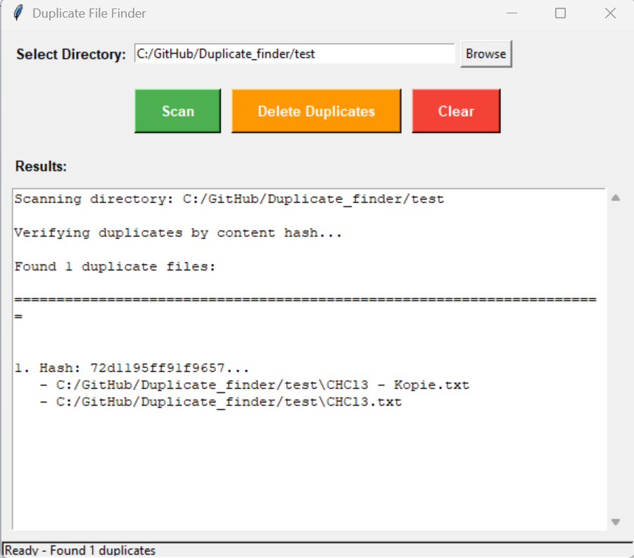

# GUI File Duplicate Finder

A user-friendly graphical tool to find and remove duplicate files in your directory structure.
Uses a two-pass detection method: fast file size comparison followed by SHA256 content hash verification.

## Features

- **Graphical User Interface** - Easy-to-use tkinter-based GUI
- **Two-pass detection algorithm**:
  1. Fast first pass: Groups files by size
  2. Accurate second pass: Verifies duplicates with SHA256 hash
- **Safe deletion** - Always keeps one copy of each file
- **Non-blocking scan** - Threaded scanning keeps GUI responsive
- **Detailed results** - Shows all duplicate file locations
- **Confirmation dialogs** - Prevents accidental deletions
### 🚀 For Most Users (Recommended)
👉 [Download the ready-to-use executable](https://github.com/DimitriosPournarkas/PyDuplicateFinder/releases/tag/V1)  
- **No installation needed**
- **Just download and double-click**
- **Works immediately on Windows**

### 💻 For Python Developers
If you have Python installed, you can also run the source code:
1. Download the `duplicate_finder.py` file
2. Open command prompt in the download folder
3. Type: `python duplicate_finder.py`
## Screenshot

## Usage

1. **Start the application**
   - From source: `python duplicate_finder.py`
   - Or run the executable directly

2. **Browse** to select a directory to scan

3. **Scan** to find duplicate files

4. **Delete Duplicates** to remove duplicates (keeps one copy of each file)

5. Use **Clear** to reset the results view

## How It Works

1. **Size Comparison**: Quickly groups files by file size
2. **Hash Verification**: Calculates SHA256 hashes for potential duplicates
3. **Safe Cleanup**: Deletes duplicates while keeping the original file

## License
MIT License - see LICENSE file for details
